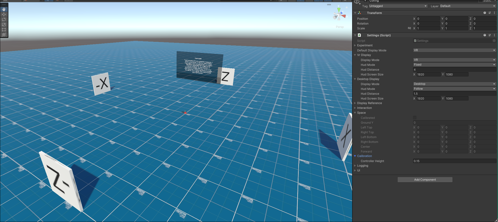
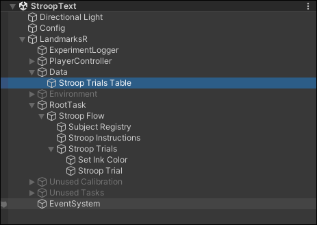
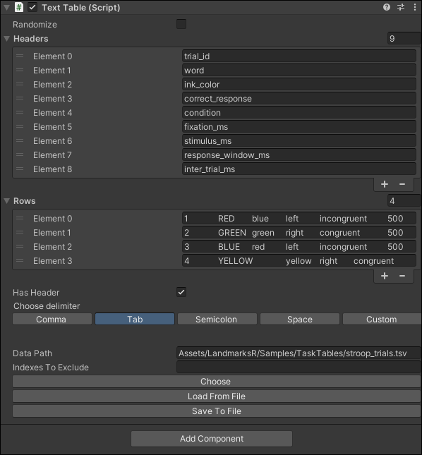
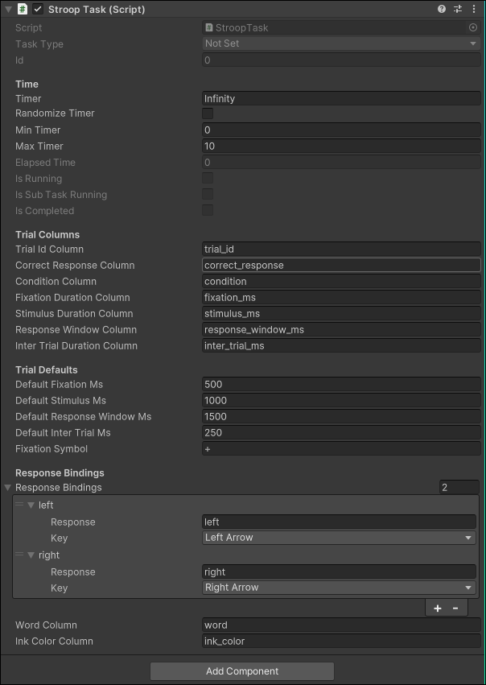

# LandmarksR

LandmarksR is a lightweight Unity framework for building spatial cognition and perception experiments on desktop and Meta Quest.

## What It Provides

- Task-based experiment flow built directly in the Unity hierarchy
- Reusable cognitive tasks such as N-back, Stroop, and Flanker
- Table-driven trial definitions with simple TSV inputs
- Built-in logging for trial outputs and experiment events
- Support for both desktop and VR-oriented setups

## Core Idea

Experiments are composed from small Unity components:

- `RootTask` starts the experiment
- structural tasks organize flow and repetition
- interactive and functional tasks present stimuli, collect responses, and control state
- text tables provide trial rows without custom code for each experiment

## Screenshots

### Meta Quest Space Calibration

### Task Core Components

## Getting Started

1. Open the project in Unity.
2. Load a demo scene from `Assets/LandmarksR/Scenes/Demo/`.
3. Press Play and run the task flow.
4. Duplicate a demo scene and swap the task graph or TSV table for your own study.

## Sample TSV Output

Example rows from an exported TSV, shown here as a Markdown table:

| run_session_id | subject_id | ts_utc | ts_unix_ms | dataset_name | trial_id | task_type | condition | stimulus | selected_response | correct_response | is_correct | has_response | reaction_time_ms | fixation_ms | stimulus_ms | response_window_ms | word | ink_color |
| --- | --- | --- | ---: | --- | ---: | --- | --- | --- | --- | --- | --- | --- | ---: | ---: | ---: | ---: | --- | --- |
| run-77 | S-77 | 2026-04-05T19:21:00.000Z | 1775416860000 | stroop_text | 1 | StroopTask | incongruent | RED:blue | left | left | true | true | 512 | 500 | 1200 | 1800 | RED | blue |
| run-77 | S-77 | 2026-04-05T19:21:02.143Z | 1775416862143 | stroop_text | 2 | StroopTask | congruent | GREEN:green | right | right | true | true | 438 | 500 | 1200 | 1800 | GREEN | green |
| run-77 | S-77 | 2026-04-05T19:21:04.366Z | 1775416864366 | stroop_text | 3 | StroopTask | incongruent | BLUE:red | right | left | false | true | 689 | 500 | 1200 | 1800 | BLUE | red |
| run-77 | S-77 | 2026-04-05T19:21:06.701Z | 1775416866701 | stroop_text | 4 | StroopTask | congruent | YELLOW:yellow | right | right | true | true | 471 | 500 | 1200 | 1800 | YELLOW | yellow |

## Documentation

See [Docfx/docs](Docfx/docs) for task structure, data tables, and framework notes.
